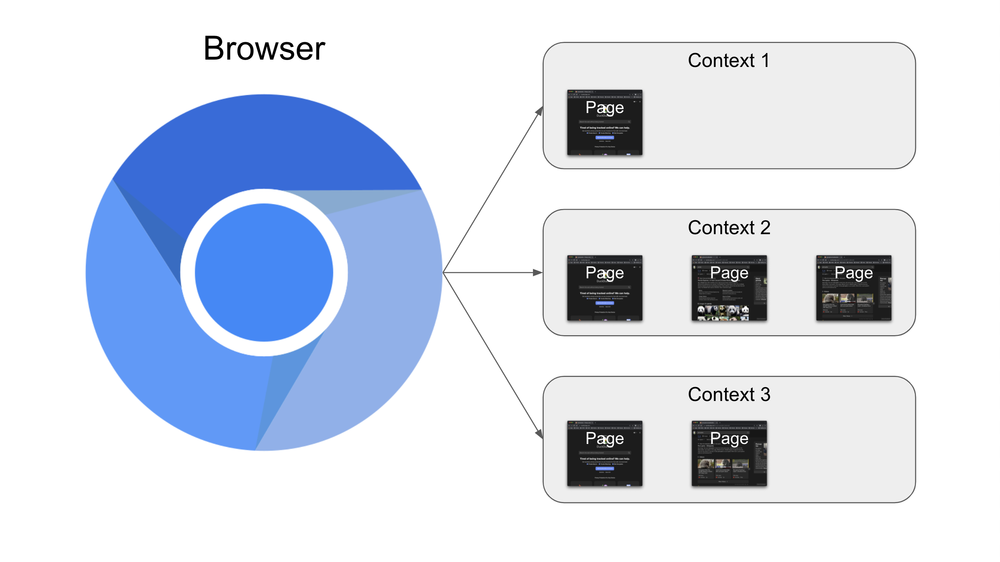
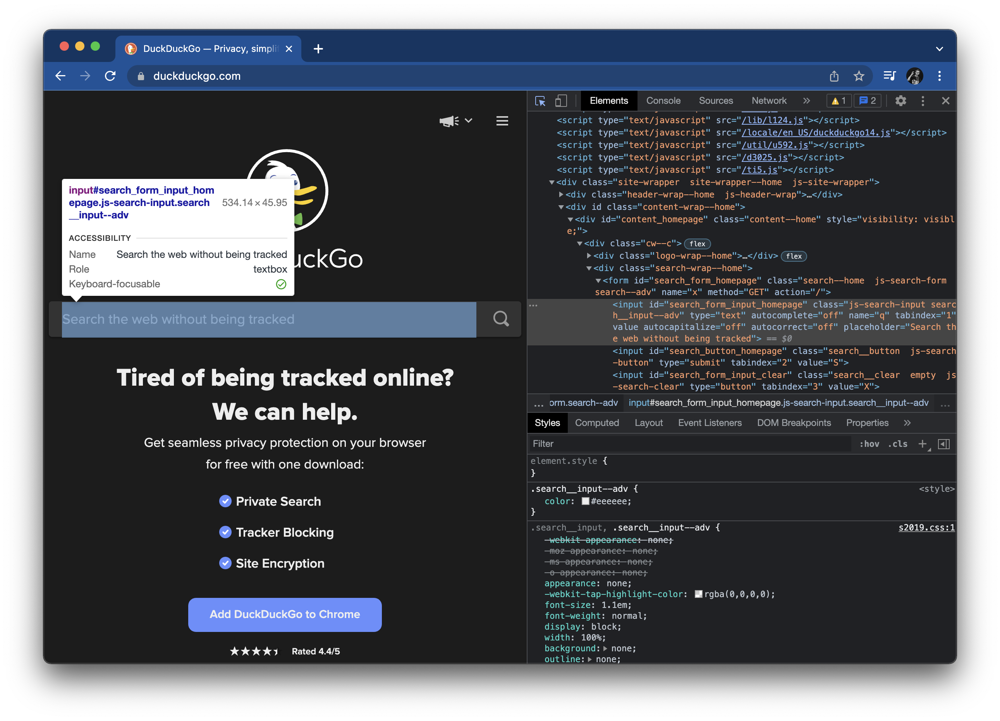

# Part 2: First steps with Playwright

Part 2 of the workshop shows how to take your first steps with Playwright calls.
It will explain browsers, contexts, and pages.
It will also cover basic Playwright API calls.


## Browsers, contexts, and pages

Before we can automate interactions using Playwright's API, we must first understand how Playwright interacts with browsers.
There are three main layers to automation: *browsers*, *browser contexts*, and *pages*:

1. A [browser](https://playwright.dev/python/docs/browsers/)
   is a single instance of a web browser.
   Playwright will automatically launch a browser instance specified by code or by inputs.
   Typically, this is either the Chromium, Firefox, or WebKit instance installed via `playwright install`,
   but it may also be other browsers installed on your local machine.
2. A [browser context](https://playwright.dev/python/docs/browser-contexts/)
   is an isolated incognito-alike session within a browser instance.
   They are fast and cheap to create.
   One browser may have multiple browser contexts.
   The recommended practice is for all tests to share one browser instance but for each test to have its own browser context.
3. A [page](https://playwright.dev/python/docs/pages/)
   is a single tab or window within a browser context.
   A browser context may have multiple pages.
   Typically, an individual test should interact with only one page.

Below is a diagram illustrating how these three pieces work together:



Typically, we would need the following Playwright calls to set up a browser, browser context, and page:

```python
from playwright.sync_api import sync_playwright

with sync_playwright() as p:
    browser = p.chromium.launch()
    context = browser.new_context()
    page = context.new_page()
```

However, the `pytest-playwright` plugin takes care of these things automatically with the following fixtures:

* The `browser` fixture provides the browser instance launched by Playwright.
* The `context` fixture provides a new browser context for a test.
* The `page` fixture provides a new browser page for a test.

All of the Playwright calls with `pytest-playwright` use the synchronous API instead of the async API.
The `browser` fixture has session scope, meaning all tests will share one browser instance.
The `context` and `page` fixtures have function scope, meaning each test gets new ones.
Typically, a test will only need to call the `page` fixture directly.
These fixtures will also automatically clean up everything after testing is complete.
You do not need to explicitly close the browser.

Let's update our test stub to call the `page` fixture.
In `tests/test_search.py`, change the test function signature from this:

```python
def test_basic_duckduckgo_search():
```

To this:

```python
def test_basic_duckduckgo_search(page):
```


## Navigating to a web page

Now the test has access to a fresh page in a new browser context.
If we write multiple tests, each test will get its own page and context,
but they will all share the same browser instance.

Now that we have a page, let's do something on it!
Our first test step is, "Given the DuckDuckGo home page is displayed".
Let's [navigate](https://playwright.dev/python/docs/navigations) to the DuckDuckGo home page like this:

```python
def test_basic_duckduckgo_search(page):
    # Given the DuckDuckGo home page is displayed
    page.goto('https://www.duckduckgo.com')
```

If you are familiar with Selenium WebDriver, then this command probably looks similar to the `driver.get(...)` method.
However, Playwright's [`goto`](https://playwright.dev/python/docs/api/class-page#page-goto) method is more sophisticated:
it waits for the page to fire the `load` event.
Selenium WebDriver does not automatically wait for any event,
which frequently leads to race conditions that cause flaky tests.

In Playwright, you can also wait for other page events like this:

```python
def test_basic_duckduckgo_search(page):
    # Given the DuckDuckGo home page is displayed
    page.goto('https://www.duckduckgo.com', wait_until='networkidle')
```

For our test, however, the default `load` event will suffice.

Let's try running our test to make sure Playwright works.
Launch pytest using the following command:

```bash
$ python3 -m pytest tests --headed --slowmo 1000
```

This invocation has two new arguments.
The first one is `--headed`.
By default, Playwright runs tests in *headless* mode, in which the browser is not visibly rendered.
Headless mode is faster than headed mode and thus ideal for "real" testing (like in CI).
However, *headed* mode is better when developing tests so that you can see what is happening.

The second new argument is `--slowmo`.
By default, Playwright runs interactions as fast as it can.
Again, this is great for "real" testing, but it might be too fast for humans to watch when developing and debugging.
The `--slowmo` option lets the caller set a hard sleep time after every Playwright call.
For example, `--slowmo 1000` will pause execution for 1 second (1000 ms) after each call.
This option is a much better way to slow down tests than to add `time.sleep(...)` calls everywhere!

When you launch pytest, Chromium should pop up, navigate to the DuckDuckGo home page, and close.
Try running it with and without the `--headed` and `--slowmo` options, too.
Verify that Playwright calls work and the test passes before moving on.


## Performing a search

Next, let's try to interact with page elements.
Playwright is able to locate any element on the page using [selectors](https://playwright.dev/python/docs/selectors).
Out of the box, Playwright supports the following types of selectors:

* Text
* CSS
* XPath
* N-th element
* React
* Vue

Text and CSS selectors also pierce the Shadow DOM by default!

In general, you should keep selectors as simple as possible.
Try to stick to text, IDs, or CSS selectors.
Use more complicated selectors only as necessary.

This workshop will not cover recommended practices for element selectors deeply.
If you want to learn more about selectors,
read the [Element selectors](https://playwright.dev/python/docs/selectors) page in the Playwright docs,
or take the [Web Element Locator Strategies](https://testautomationu.applitools.com/web-element-locator-strategies/) course
from [Test Automation University](https://testautomationu.applitools.com/).

The next step in our test case is, "When the user searches for a phrase".
This is actually a compound interaction with two parts:

1. Entering text into the search input field
2. Clicking the search button

Let's start with the first part of the interaction: entering text into the search input field.
We need to find a selector for the search input.
One of the best ways to find selectors is to inspect elements through Chrome DevTools.
In Chrome, simply right-click any page and select "Inspect" to open DevTools.

Here's the inspection panel for the search input element:



Thankfully, this element has an ID.
We can use the selector `#search_form_input_homepage` to uniquely identify this element.

To enter text into this input element, we must use Playwright's
[`fill`](https://playwright.dev/python/docs/api/class-page#page-fill) method.
Append the following line to the test case:

```python
    page.fill('#search_form_input_homepage', 'panda')
```

Using Selenium WebDriver, we would need to locate the element and then send the interaction to it.
However, in Playwright, these two parts are combined into a single call.
Furthermore, Playwright waits for the target element to be visible and editable before it attempts to enter the text.
We are arbitrarily using the phrase `'panda'` as our search phrase because, well, why not?

Let's handle the second part of the interaction: clicking the search button.
Here's the inspection panel for the search button:


This element also has an ID: `#search_button_homepage`. Nice!

To click an element, we must use Playwright's
[`click`](https://playwright.dev/python/docs/api/class-page#page-click) method.
Append the following line to the test case:

```python
    page.click('#search_button_homepage')
```

Again, Playwright is nice and concise.
The `click` method waits for the target element to be ready to receive clicks, too.

Our test case should now look like this:

```python
def test_basic_duckduckgo_search(page):

    # Given the DuckDuckGo home page is displayed
    page.goto('https://www.duckduckgo.com')

    # When the user searches for a phrase
    page.fill('#search_form_input_homepage', 'panda')
    page.click('#search_button_homepage')

    # Then the search result query is the phrase
    # And the search result links pertain to the phrase
    # And the search result title contains the phrase
    pass
```

Rerun the test using `python3 -m pytest tests --headed --slowmo 1000`.
Now, you should see the test actually perform the search!

Navigation, input filling, and clicking are only three of many page interactions you can do with Playwright.
Anything a user can do on a web page, Playwright can do as well.
Check out the Playwright [Page](https://playwright.dev/python/docs/api/class-page) API to see *all* methods and attributes.
We will use more of these calls in the next workshop parts.
